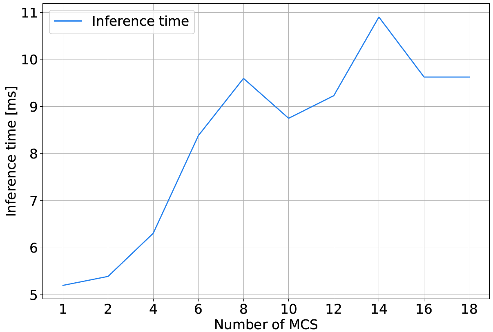

# Adaptive Dispatching of Mobile Charging Stations using Multi-Agent Graph Convolutional Cooperative Reinforcement Learning
This is the pytorch/pytorch-geometric implementation of AdapMCS as described in the paper: "Adaptive Dispatching of Mobile Charging Stations using Multi-Agent Graph Convolutional Cooperative Reinforcement Learning".

<h3>Inference Times</h3>

